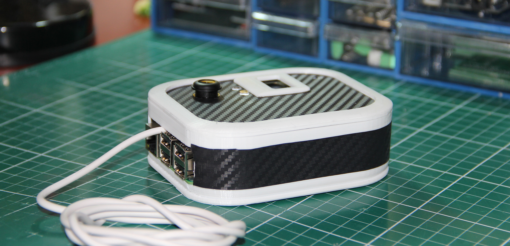

# Mesai Takip Cihazı
## Kütahya İl Özel İdaresi - Bilgi işlem müdürlüğü


Kütahya İl Özel İdaresi olarak geliştirmiş olduğumuz mesai takip cihazı. Yazılımı, devre tasarımı ve (3d yazdırılabilir) kutu tasarımı tamamen bize aittir. Tüm Raspberry Pi sürümleri ile çalışmaktadır. Fakat kutu RP3 için tasarlandığından diğer sürümleri için revizyon gerekir Cihaz kameranın bir özelliği olarak 135 derece oval fotoğraf almaktadır. Ayrıca yine kameranın bir özelliği olarak karanlık ortamlarda da -gece görüşü- fotoğraf alabilmektedir.

13.56 Mhz rfid kart ile uyumludur. Kart okutulduğunda personelin resmini alır, led ışık ve ses ile sinyal verir, sonra belirtilen web servisine geçiş hakkında istek gönderir. Cevap olarak bir geçiş ID 'si ve personel ismini bekler. Istenilir ise kart okuduktan sonra bir turnikeye yada diğer bir donanıma tetikleme yapılabilir.

Sunucuya ulaşamaz ise offline olarak çalışabilir. Çekilen fotoğraflar geçiş zaman bilgileri ile birlikte tutulur. Sonra merkezi bilgi sisteminiz ftp bağlantısı ile resimleri alıp dosya sunucunuza taşıyabilir. Yada "aktar.py" dosyası belirli peryotlarda çalıştırılarak (cron) istenilen sunucuya yükleme işlemi cihaz tarafından da yapılabilir.

Uygulama çalışma esnasında logları cihazin dosya sistemine txt dosyası olarak yazar. Beklenmedik bir hata oluşur ise hem offline logu tutulup hem de bir mesaj kuyruğuna (varsayılan RabbitMQ) log olarak yazılır.

Uyguluma sorunsuz çalıştığı süre zarfında belirli aralıklarla bir Mqtt kuyruğuna sıhhat bilgisini gönderebilir.

Cihazın crontab ile uygun görülen bir zamanda günde bir sefer yeniden başlatılması önerilir.

İstenir ise cihazlar tek bir merkezden güncelleme alabilir (guncelle.py).





## Bileşenler
 1. Raspberry Pi (3 önerilir)
 2. Mikro SD kart
 3. Raspberry Pi Camera (Raspberry Pi 3 Model B + Night Vision Camera 5MP Wide Angle 135 Degree Fisheye Lens 1080P Camera Module)
 4. PCB Devre
 5. SSD 1306 Oled LCD ekran (128*64)
 6. RFID-RC522 rfid kart okuyucu
 7. Kırmızı ve yeşil kesik baş led
 8. 5V mini usb adaptor ve kablo
 9. Tek kanal 5v röle kartı (Opsiyonel)
 10. 3D yazdırılmış kutu parçaları
 11. Kaplama için yeteri kadar karbon folyo (Opsiyonel)
 12. 4 adet 2.2x6 mm ve 3 adet 2.2x9 mm vida
 13. 13x2, 4x1, 8x1 dişi header 


## Kurulum

1. Image ile kurulum
.img dosyası indirilip micro sd karta "Win32 Disk Imager" yada benzeri bir uygulama ile yazılıp 

2. Manuel kurulum
   - Raspbian işletim sistemi sd karta yüklenir ve açılır
   - `sudo raspi-config` ile ayar ekranı açılıp  ssh, camera, i2c ve spi aktifleştirilir
   - Aşağıdaki kurulumlar yapılır.
    ```
    sudo apt-get update
    sudo apt-get upgrade

    sudo apt-get install vsftpd apache2 git  python-spidev  python-dev python-pip python-smbus python-picamera python-netifaces python-imaging python-smbus i2c-tools wondershaper -y
	
    sudo chmod 777 -R /var/www/html/
    
    git clone https://github.com/lthiery/SPI-Py.git
    cd ~/SPI-Py
    sudo python setup.py install
    
    pip install pika
    pip install paho-mqtt
    pip install requests
	
    git clone https://github.com/adafruit/Adafruit_Python_SSD1306.git
    cd Adafruit_Python_SSD1306
    sudo python setup.py install
    ```
   - `sudo crontab -e` ile zamanlanmış görevler açılıp en alta aşağıdaki 5 satır eklenir.
    ```
    @reboot sleep 5 && python /var/www/html/temizle.py &
    @reboot sleep 20 && python /var/www/html/index.py &
    30 22 * * *     /sbin/shutdown -r +1 &
	0 */2 * * * python /var/www/html/aktar.py &
	0 12 * * * python /var/www/html/guncelle.py &
    ```
   - index.py, MFRC522.py ve temizle.py guncelle.py aktar.py /var/www/html dizinine kopyalanır.
   - Font klasöründeki lato.ttf dosyası /var/www/html/font dizinine kopyalanır.
   - logo.png dosyası /var/www/html/img dizinine kopyalanır.
   - Arduino klasorundeki buzzer.ino dosyası Arduino nanoya upload edilir.